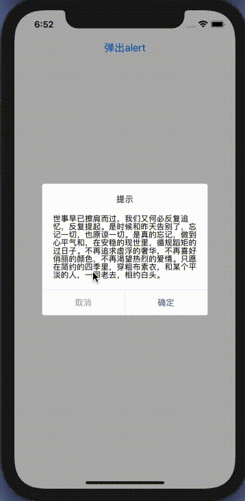

### @weedx/react-native-alert-view

------

A <Alert> component for react-native

Version 0.x recommends react-native >= 0.57.0



#### Installation

------

Using npm:

```
npm install --save @weedx/react-native-alert-view
```

or using yarn:

```
yarn add @weedx/react-native-alert-view
```

#### Usage

------

1.pass string to message:
for 0.1.x:

```javascript
import AlertViewManager from '@weedx/react-native-alert-view';
AlertViewManager.show(
  '提示',
  '一段提示文字',
);
```

for 0.2.x:

```javascript
import AlertViewManager from '@weedx/react-native-alert-view';
AlertViewManager.show({
  title:'提示',
  message: '一段提示文字',
});
```

2.pass element to message:
for 0.1.x:

```javascript
import AlertViewManager from '@weedx/react-native-alert-view';
AlertViewManager.show(
  '提示',
  <View>
  	<Text>一段提示文字</Text>
  </View>,
);
```
for 0.2.x:

```javascript
import AlertViewManager from '@weedx/react-native-alert-view';
AlertViewManager.show({
  title: '提示',
  message: <View>
  	<Text>一段提示文字</Text>
  </View>,
});
```

3.pass options & event to alertView:
for 0.1.x:

```javascript
import AlertViewManager from '@weedx/react-native-alert-view';
AlertViewManager.show(
  '提示',
  '一段提示文字',
  {
    cancelText: '取消',
    confirmText: '确认'
    ...
  },
  () => {
    console.log('处理confirm')
  },
  () => {
    console.log('处理cancel')
  }
);
```

for 0.2.x:

```javascript
import AlertViewManager from '@weedx/react-native-alert-view';
AlertViewManager.show({
  title: '提示',
  message: '一段提示文字',
  cancelText: '取消',
  confirmText: '确认'
  ...,
  onConfirmPressed: () => {
    console.log('处理confirm')
  },
  onCancelPressed: () => {
    console.log('处理cancel')
  }
});
```

##### Configurable props

- animationDuration
- overlayOpacity
- title
- message
- singleClick
- cancelText
- confirmText
- hideOnHardwareBackPress
- titleStyle
- contentStyle
- contentContainerStyle
- cancelStyle
- confirmStyle  

##### Methods

- show
- update
- hide